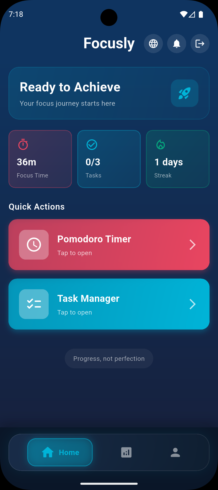
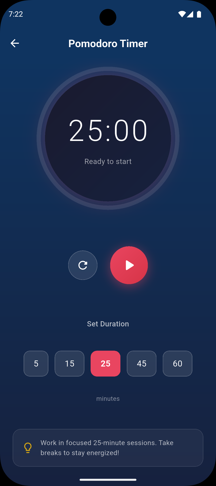
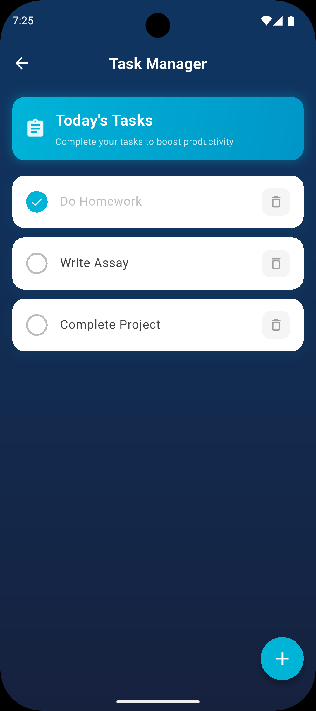
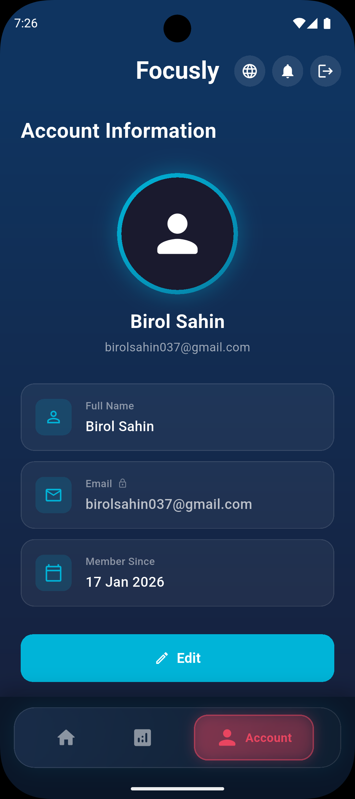

# 📱 Focusly – Productivity & Focus App

Focusly is a Flutter-based productivity application designed to help users stay focused, manage tasks efficiently, and analyze their productivity habits. The app combines a Pomodoro timer, task management system, and usage analytics to create a complete focus management experience.

---

## 🚀 Features

### ⏳ Pomodoro Timer
- Customizable focus and break durations
- Start / Pause / Reset timer functionality
- Helps improve deep work and productivity
- Simple and distraction-free UI

### ✅ Task Management (To-Do)
- Create, edit, and delete tasks
- Mark tasks as completed
- Organize daily productivity workflow
- Lightweight and fast task tracking

### 📊 Usage Analytics
- Track completed focus sessions
- Monitor productivity patterns
- Visualize time spent focusing
- Helps users improve their work habits

---

## 🖼️ App Screenshots

### 🏠 Home Screen


### ⏳ Pomodoro Timer


### ✅ Task Management


### 📊 Profile Screen



---

## 🧠 Tech Stack

- Flutter
- Dart
- State Management (Provider / Riverpod / Bloc → update based on what you used)
- Local Storage (SharedPreferences / Hive / SQLite → update based on your project)
- Material UI

---

## ⚙️ Installation

### 1️⃣ Clone Repository

```bash
git clone https://github.com/yourusername/focusly.git
cd focusly

